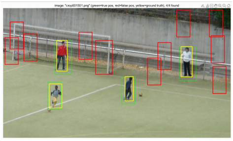
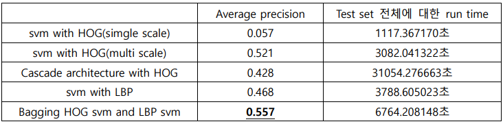

# Sliding Window-based Pedestrian Detection Algorithm using HOG feature and SVM
SNU ECE ICV21 Final Project
## Overview
**MATLAB** implemention of a sliding window-based pedestrian detection algorithm using HOG, LBP feature. The algorithm is trained using the INRIA person dataset.

-  Detection using HOG and SVM - Navneet Dalal and Bill Triggs, Histograms of Oriented Gradients for Human Detection,
CVPR 2005
-  Cascade architecture -  Qiang Zhu et al., Fast Human Detection Using a Cascade of Histograms of Oriented
Gradients, CVPR2006
-  Detection using LBP and SVM - Y. Mu, S. Yan, Y. Liu, T. Huang, B. Zhou, Discriminative local binary patterns for human
detection in personal album, CVPR 2008

